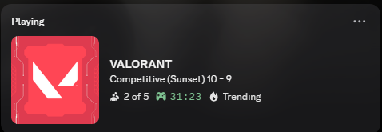
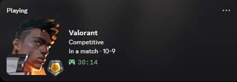
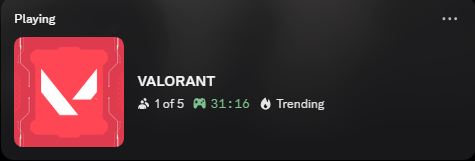
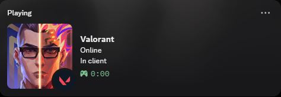
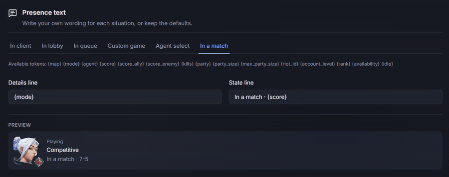

<div align="center">


<h1>Valorant RPC</h1>

<p>A better Valorant Rich Presence for Discord.</p>

<p>
<a href="https://github.com/Its-Haze/valorant-rpc/releases/latest"></a>
<a href="https://github.com/Its-Haze/valorant-rpc/stargazers"></a>
<a href="https://github.com/Its-Haze/valorant-rpc/releases/latest"></a>
<a href="https://github.com/Its-Haze/valorant-rpc/blob/main/LICENSE"></a>
</p>

<h3><a href="https://github.com/Its-Haze/valorant-rpc/releases/latest"><strong>Download for Windows &raquo;</strong></a></h3>

<p>
<a href="#showcase">Showcase</a>
&middot;
<a href="#installation">Installation</a>
&middot;
<a href="#-faq">FAQ</a>
</p>

</div>

Valorant RPC replaces the presence Valorant gives Discord with one that actually says something:
your agent, your rank, the map, the round score. Every line of it is a template you can rewrite.

> **Also playing League?** [League RPC](https://github.com/Its-Haze/league-rpc) came first, and this is built on the same foundations.

---

## Showcase

<table>
<tr>
<th width="50%">❌ Valorant's own presence</th>
<th width="50%">✅ With Valorant RPC</th>
</tr>
<tr>
<td></td>
<td></td>
</tr>
<tr>
<td></td>
<td></td>
</tr>
</table>

### You choose what to show



---

## Installation

### 📥 Getting Started
1. Head over to the [Releases Page](https://github.com/Its-Haze/valorant-rpc/releases)
2. Download `valorant-rpc-<version>-setup.exe` from the latest release (it's under Assets)
3. Run it and accept the Windows security popup if it shows up
4. Start Valorant and Discord, in whatever order you like
5. That's it! ✨

Closing the window keeps Valorant RPC running in your system tray. Quit from there when you want it to stop.

Already running [League RPC](https://github.com/Its-Haze/league-rpc)? The two run side by side without stepping on each other.

### 🔄 Updating
You can update directly from the app. If you have **update notifications** enabled, you will see a notification that a new version is available.

Otherwise go to **About** → **Check for updates** and install from there.

---

## ❓ FAQ

### 🚫 Will this get my account banned?
Nope! It only reads what the Riot Client already publishes on your own computer. It changes nothing, injects nothing, never writes anything back to Riot, and gives you no advantage in game, so Vanguard has no reason to care. It's an independent open-source project, not affiliated with Riot Games.

### 🛡️ Is this a virus? Why is Windows warning me?
No, and because it isn't code-signed. A certificate costs $100 a year, which is hard to justify for a free project, so Windows distrusts an installer it hasn't seen before. Click **More info**, then **Run anyway**, and whitelist it if Defender gets loud. The entire source code is public on GitHub, so review it or build it yourself.

### 🎭 Why is my agent only there once the match starts?
It comes from Valorant's own log file, and that file doesn't name your agent until you've loaded in. Agent select still shows your player card. If you'd rather keep the card during the match too, **Display** → **Picture during a match** switches it.

There's a longer FAQ inside the app, under **Help**, for the questions you only run into once it's running.

---

## 🏗️ Build from Source
For the cool kids who want to build it themselves:

```powershell
# Clone and navigate
git clone https://github.com/Its-Haze/valorant-rpc.git
cd valorant-rpc

# Build
task build
```

You'll need Go, Node and [Task](https://taskfile.dev/). [CONTRIBUTING.md](CONTRIBUTING.md) has the rest.

---

## 💖 Support the project
Valorant RPC is free, and it stays that way. No ads, no accounts, no feature locked behind a payment.
I build and maintain it in my spare time because I wanted it to exist.

If it's earned a spot in your startup folder and you'd like to chip in toward keeping it maintained,
there are two ways:

- [**GitHub Sponsors**](https://github.com/sponsors/Its-Haze) takes no cut, and does one-time or monthly.
- [**Ko-fi**](https://ko-fi.com/itshaze) needs no account, just a card or PayPal.

[](https://ko-fi.com/O0N227CV0N)

Neither unlocks a feature. Supporters get a role in the [Discord](https://discord.haze.sh), and a star costs nothing at all.

---

## 📞 Contact and Support
Got questions? Join the [Discord Server](https://discord.haze.sh)
Feel free to open up Help tickets, or contact me directly on Discord (@haze.dev).

For issues related to the code, or project as a whole, please open an [issue on GitHub](https://github.com/Its-Haze/valorant-rpc/issues). Before you do, hit **Copy diagnostics** on the app's Help screen and paste the result in. It gathers most of what I'd otherwise have to ask you for.

## Star History

<a href="https://www.star-history.com/?repos=Its-Haze%2Fvalorant-rpc&type=date&legend=top-left">
 <picture>
   <source media="(prefers-color-scheme: dark)" srcset="https://api.star-history.com/chart?repos=Its-Haze/valorant-rpc&type=date&theme=dark&legend=top-left" />
   <source media="(prefers-color-scheme: light)" srcset="https://api.star-history.com/chart?repos=Its-Haze/valorant-rpc&type=date&legend=top-left" />
   
 </picture>
</a>
